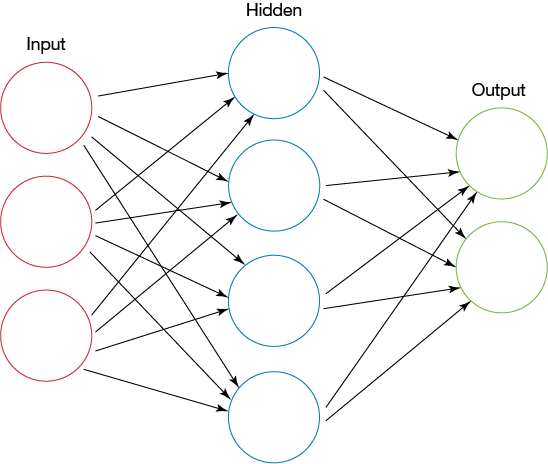

# Neural-Network-from-scratch

In this repository you can find Neural Network written in numpy from scratch, with some theory explanation and methamatical background connected to this subject and some intuition related to. It's one of the most basic models in machine learning.

This repository is done in collaboration with [@tugot17](https://github.com/tugot17) 

The main file is Neural_net.ipynb

## How to run:
After downloading this repo you have to unpack all data files in Neural_net/mnist_data . You can do it using 7zip on windows, or any other compressor to this folder. After doing this just open notebook.

## Required Python Packages
1. matplotlib
2. numpy
3. tqdm
4. urlib
